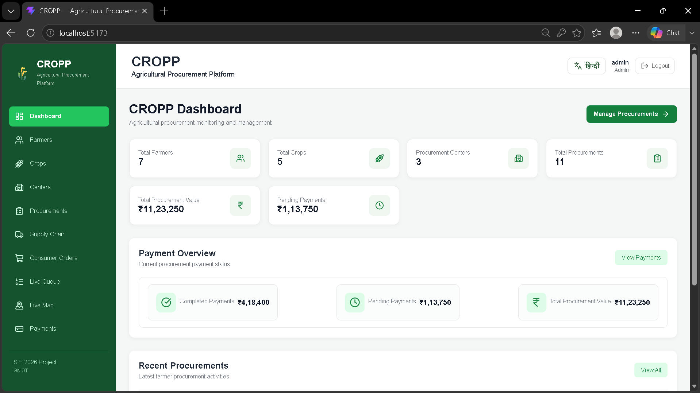
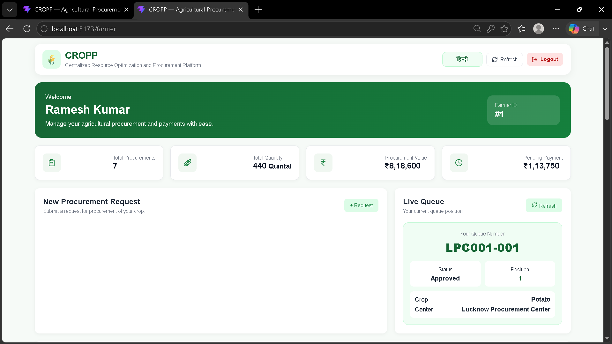
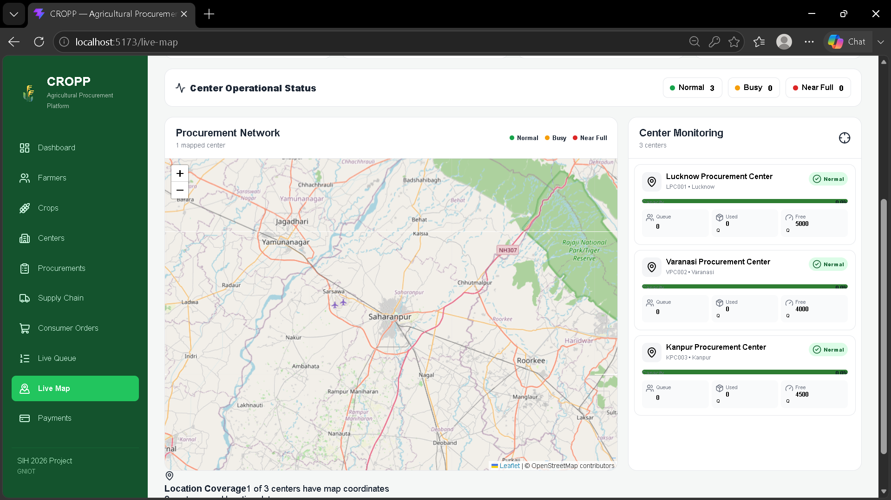
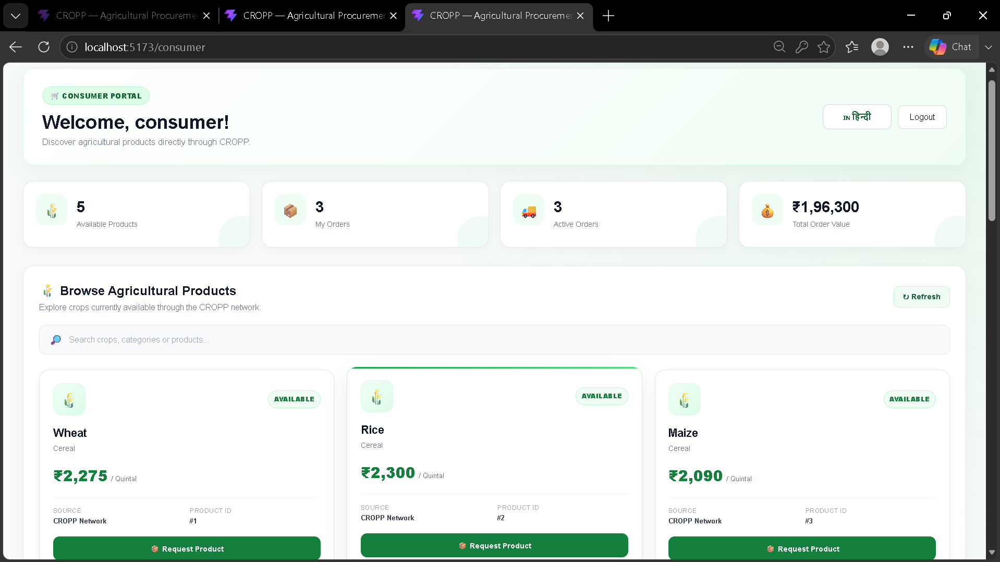

🚜 CROPP — Centralized Resource Optimization & Procurement Platform

«A software solution for improving transparency, coordination, and efficiency in agricultural procurement.»

CROPP (Centralized Resource Optimization & Procurement Platform) is a multi-role web platform developed for Smart India Hackathon (SIH) 2026 under the problem statement:

SIH26032 — Farmer Procurement Status & Scheduling Platform

The platform aims to simplify the agricultural procurement process by providing a centralized system for farmers, procurement centers, administrators, and consumers.

---

🎯 Problem Statement

Agricultural procurement can involve multiple stakeholders and processes, including farmer requests, scheduling, queues, procurement centers, payments, and product movement.

Without proper digital coordination, users may face difficulties in:

- Tracking procurement status
- Managing procurement schedules
- Monitoring queues
- Coordinating with procurement centers
- Tracking payments
- Maintaining centralized procurement information

CROPP was designed as a prototype to address these challenges through a centralized digital platform.

---

💡 Our Solution

CROPP brings different stakeholders into one platform and provides role-specific interfaces for managing and monitoring the procurement process.

👨‍🌾 Farmer Portal

Farmers can interact with the procurement system through features such as:

- Procurement request management
- Procurement status tracking
- Queue/status information
- Payment status
- Procurement-related information

🏢 Admin Dashboard

The administrator can monitor and manage different aspects of the platform, including:

- Farmer information
- Procurement activities
- Procurement centers
- Queue/status information
- Payment-related information
- Overall system monitoring

🛒 Consumer Portal

The consumer-facing section provides an interface for interacting with available agricultural products and related information.

🗺️ Procurement Center Monitoring

The platform includes procurement-center monitoring with location/status visualization to provide better visibility into procurement operations.

---

✨ Key Features

- 👨‍🌾 Farmer procurement management
- 📊 Procurement status tracking
- 🔢 Queue management
- 🏢 Procurement center monitoring
- 💰 Payment status tracking
- 🗺️ Location-based procurement center visualization
- 🛒 Consumer portal
- 🛠️ Admin dashboard
- 🌐 Hindi/English interface
- 🔗 Frontend–backend API integration
- 🗄️ Centralized database management

---

🏗️ Project Architecture

CROPP follows a frontend–backend architecture:

                    ┌─────────────────────┐
                    │       CROPP         │
                    │   Web Platform      │
                    └──────────┬──────────┘
                               │
                    ┌──────────▼──────────┐
                    │      Frontend       │
                    │ React / JavaScript  │
                    │ HTML / CSS          │
                    └──────────┬──────────┘
                               │
                         API Communication
                               │
                    ┌──────────▼──────────┐
                    │       Backend       │
                    │   Python + Flask    │
                    └──────────┬──────────┘
                               │
                    ┌──────────▼──────────┐
                    │       MySQL         │
                    │      Database       │
                    └─────────────────────┘

---

🛠️ Technology Stack

Frontend

- React
- JavaScript
- HTML
- CSS

Backend

- Python
- Flask

Database

- MySQL

API / Integration

- Axios
- Local APIs

---

👥 Team

Team — Samadhan X

Member| Role
Pradum Goyal| Team Leader & Backend/Technical Lead
Aditya| Team Member & Presentation
Harsh| Team Member & Presentation
Himesh| Team Member & Checker
Chirag| Team Member & Technical support
Pari| Team Member & Research

---

🧑‍💻 My Contribution

As the Team Leader & Backend/Technical Lead, my primary responsibilities included:

- Coordinating the development team
- Working on the backend using Python & Flask
- Working with MySQL for database management
- Developing and integrating APIs
- Connecting frontend and backend using Axios
- Handling technical integration between different modules
- Contributing to the overall system architecture and implementation

---

🚀 Project Structure

CROPP/
│
├── backend/
│   └── Backend source code and API implementation
│
├── frontend/
│   └── Frontend application
│
├── .gitignore
├── CNAME
└── README.md

---

⚙️ Getting Started

1. Clone the repository

git clone https://github.com/pradumgoyal15/CROPP.git
cd CROPP

2. Open the project

The project contains separate:

frontend/
backend/

directories.

3. Backend setup

Navigate to the backend directory:

cd backend

Install the required Python dependencies according to the project's dependency configuration.

Start the Flask backend using the project's configured entry point.

4. Frontend setup

Open another terminal and navigate to:

cd frontend

Install the required dependencies:

npm install

Then start the frontend development server:

npm start

«Note: Database configuration, environment variables, API endpoints, and startup commands may need to be adjusted according to your local development environment.»

---

📸 Project Preview

Admin Dashboard

Farmer Portal

Procurement Center Map

Consumer Portal

---

🎯 Purpose

CROPP was developed as a Smart India Hackathon 2026 prototype to explore how software can be used to improve agricultural procurement workflows.

The project focuses on:

Transparency → Coordination → Tracking → Better Procurement Management

---

📚 What We Learned

Working on CROPP helped our team gain practical experience in:

- Full-stack web development
- Backend development with Python & Flask
- Database management with MySQL
- API integration
- React-based frontend development
- Team collaboration
- Technical problem solving
- Building software around a real-world problem
- Working under hackathon time constraints

---

🔮 Future Scope

Possible future improvements include:

- Real-time notifications
- SMS/WhatsApp-based status updates
- Advanced analytics and reporting
- Improved scheduling algorithms
- Cloud deployment
- Authentication and role-based access control improvements
- Mobile application support
- Integration with real-world procurement systems
- Scalable production-ready infrastructure

---

⚠️ Disclaimer

CROPP is a hackathon prototype developed for Smart India Hackathon 2026.

It is intended to demonstrate the proposed workflow and technical approach and is not currently presented as a production-ready government procurement platform.

---

📌 Project Information

Hackathon: Smart India Hackathon 2026
Problem Statement: SIH26032
Project: CROPP
Team: Samadhan X
Type: Software Prototype
Domain: Agricultural Procurement

---

🔗 Links

GitHub Repository:
https://github.com/pradumgoyal15/CROPP

Live Prototype:
Add your deployed prototype link here

---

⭐ Support

If you find this project interesting, consider giving the repository a ⭐ and exploring the code.

Built with 💻, teamwork, and a lot of learning.
